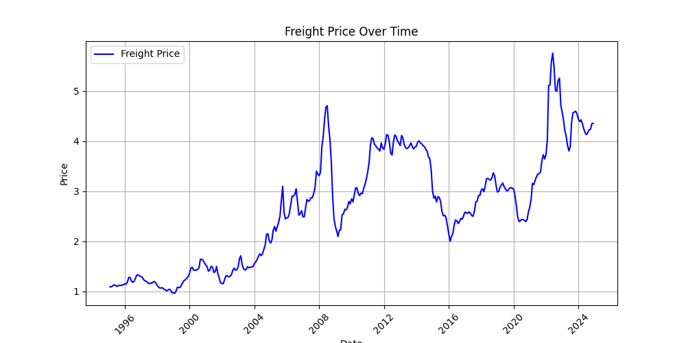

This code is for doing data analysis work related to the trucking industry

There are various different scripts you can run. To get set up, download the code, install the python dependencies, and run whichever script you want.

### Data Sources

- `fuel-prices.xlsx`: https://www.bts.gov/browse-statistical-products-and-data/info-gallery/truck-spot-rates-jan-2015-oct-2023

### Data Analysis

